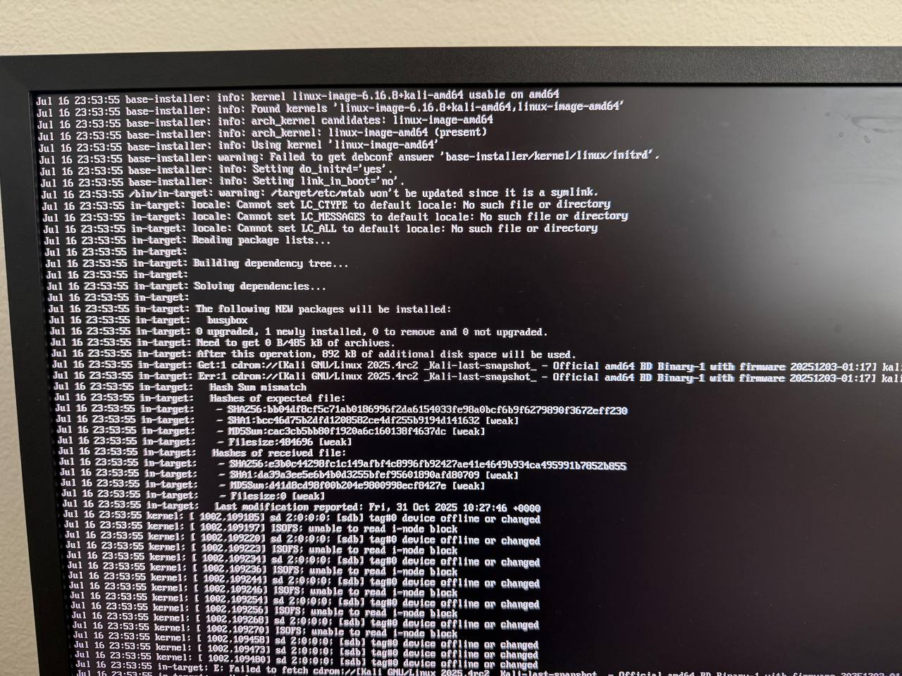

# Kali Installation on the X1S NVMe

## Storage roles

- A microSD card in a USB reader is temporary installation media.
- The internal 128 GB M.2 2280 NVMe is the permanent Kali target.
- The X1S native microSD slot is not part of this installation path.

The review sample arrived without eMMC storage. Youyeetoo later supplied the
NVMe used for this rebuild.

## Prepare the installer

1. Download the Kali Linux amd64 Installer ISO and verify its SHA-256 against
   Kali's published checksum.
2. Insert a disposable or fully backed-up microSD card into a USB card reader.
3. In Rufus, select only that reader. The tested setup used Kali 2025.4 amd64,
   MBR, BIOS-or-UEFI target, and FAT32 defaults.
4. Write the ISOHybrid image. ISO Image mode was selected for this run.
5. Eject the completed installer cleanly.

## Connect and boot

With power disconnected, verify that the NVMe is fully inserted and secured,
and that the active fan is connected. Then connect HDMI, keyboard/mouse,
Ethernet if available, and the USB reader. Connect power last and choose the USB
installer from the firmware boot menu if it is not selected automatically.

## Installer choices used

- Language and keyboard: user preference.
- Network: Ethernet DHCP succeeded after the cable was connected.
- Hostname: any short local name; a domain is unnecessary on a home lab.
- Partitioning: guided, use entire disk, all files in one partition.
- Target disk: the approximately 128 GB `nvme0n1`, never the approximately
  64 GB `sdb` installer media.
- Software: Xfce, Kali top-10 tools, and Kali default recommended tools.
- Bootloader: install to the NVMe.

Remove the USB installer when the installer requests a reboot. A successful
result reaches the Kali boot menu and Xfce login with only the NVMe installed.

## First-attempt BusyBox failure

The first install stopped while installing BusyBox. Installer logs showed a
hash mismatch followed by repeated `/dev/sdb` `device offline or changed` and
ISOFS read errors. That evidence points to the USB reader/source-media path,
not the target NVMe.

The successful retry used the text installer with the USB reader moved to a
blue USB 3 port. The install then completed with the same image and target.
That change is a strong operational workaround from this run, but it does not
prove whether the original fault was the port, reader contact, transient media
state, or their combination.



## First-boot validation

Before tuning, record:

```bash
date --iso-8601=seconds
cat /etc/os-release
uname -a
lscpu
free -h
lsblk -o NAME,MODEL,SIZE,TYPE,FSTYPE,MOUNTPOINTS
lspci -nn
lsusb
systemctl --failed
```

Do not publish passwords, private keys, public IP addresses, VPN addresses, or
home-LAN details with the resulting logs.
