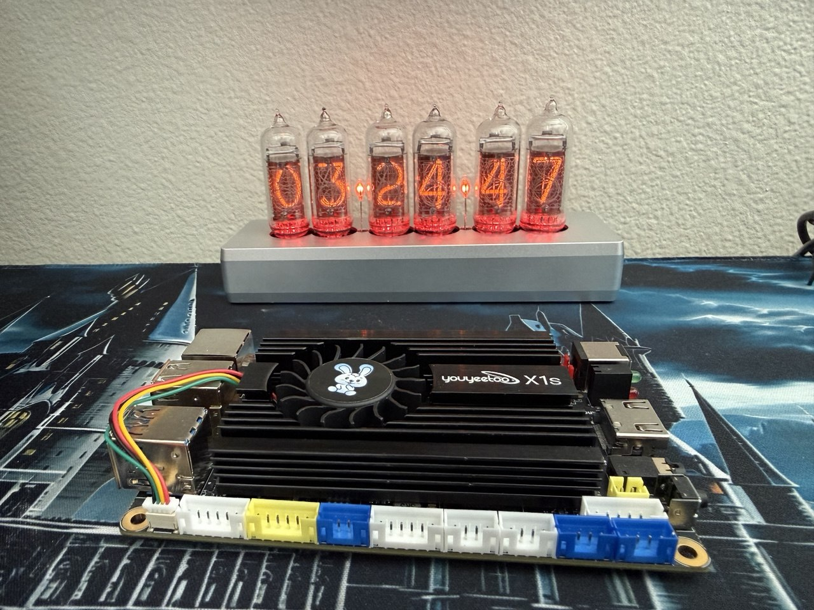

# Youyeetoo X1S Kali Linux Lab

Reproducible installation notes, CPU-only local-LLM benchmarks, sustained
thermal evaluation, and native-x86 Kali tool compatibility results for the
Youyeetoo X1S with an Intel Celeron N5095, 16 GB RAM, and 128 GB NVMe.



## Bottom line

The supplied 128 GB NVMe resolved the sample's missing-storage problem and Kali
2025.4 now boots reliably from internal NVMe. The open-bench system completed a
verified 15-minute, four-core `stress-ng` workload at 100% sampled CPU without
a throttle event, frequency decline, failed service, or relevant kernel error.
Package temperature averaged 74.66 C and peaked at 77 C; the NVMe remained at
35.9 C.

The stock Kali amd64 default and top-10 toolsets installed and launched the
representative professional tools tested here. CPU-only local inference is
practical with small models: about 6.8 tokens/second for 0.6B, 3.1 for 1.7B,
roughly 2 for 4B-class models, and 0.924 for 8B in the fixed benchmark. A
full-resolution Gemma 3 4B vision request did not finish within 20 minutes, a
useful negative result that marks the tested CPU's practical boundary.

## Key results

| Area | Result |
| --- | --- |
| Kali installation | Successful NVMe boot after USB-installer media troubleshooting |
| Thermal soak | 15 min, 4/4 workers passed, 77 C peak, zero throttle counts |
| NVMe thermal | 35.9 C peak during all-core soak and inference |
| Best interactive LLM tier tested | Qwen3 1.7B, 3.129 warm generation tok/s |
| 4B text inference | 1.824-1.995 warm generation tok/s |
| 8B text inference | Fits in RAM; 0.924 warm generation tok/s |
| Full-HD 4B vision | No output before fixed 20-minute timeout |
| Kali compatibility | 14/14 representative checks produced intended tool output |

## Repository map

- [INSTALLATION.md](INSTALLATION.md): USB-installer-to-NVMe procedure and the
  BusyBox/source-media failure that interrupted the first attempt.
- [METHODOLOGY.md](METHODOLOGY.md): test definitions, guards, and limitations.
- [BENCHMARK_RESULTS.md](BENCHMARK_RESULTS.md): inference, vision, and thermal
  analysis.
- [KALI_TOOL_RESULTS.md](KALI_TOOL_RESULTS.md): bounded professional-tool
  compatibility matrix.
- `scripts/`: reusable Bash collectors and guarded test runners.
- `results/`: selected raw JSON, CSV, package, command, and health evidence.
- `images/`: publication-safe installation and hardware evidence.

## Reproduce the bounded tests

Review every script before running it. Thermal and benchmark scripts create a
new output directory and do not require an external target.

```bash
# 15-minute all-core soak; stops the workload at 85 C
MAX_TEMP_C=85 DURATION=15m ./scripts/thermal_soak.sh

# Safe compatibility/startup matrix; Nmap target is loopback only
./scripts/kali_tool_matrix.sh

# CPU-only Ollama model matrix; requires the listed models first
MAX_TEMP_C=85 ./scripts/benchmark_ollama.sh
```

## Disclosure

The X1S review unit and 128 GB NVMe were provided by Youyeetoo. Testing,
interpretation, negative results, and publication decisions remained
independent. No payment or approval of conclusions is represented here.

This is one board in one open-bench configuration with the supplied heatsink
and active fan. It is not a certification for every enclosure, ambient
temperature, workload, or production duty cycle.

## Responsible-use boundary

The security-tool matrix contains no external scan, exploitation, credential
attack, cracking target, wireless capture, or packet injection. Use Kali tools
only on systems you own or are explicitly authorized to test.

## License

Code is licensed under the [MIT License](LICENSE). Benchmark observations,
tables, and images are provided for attribution-based reference; contact the
author before republishing photographs as standalone media.
