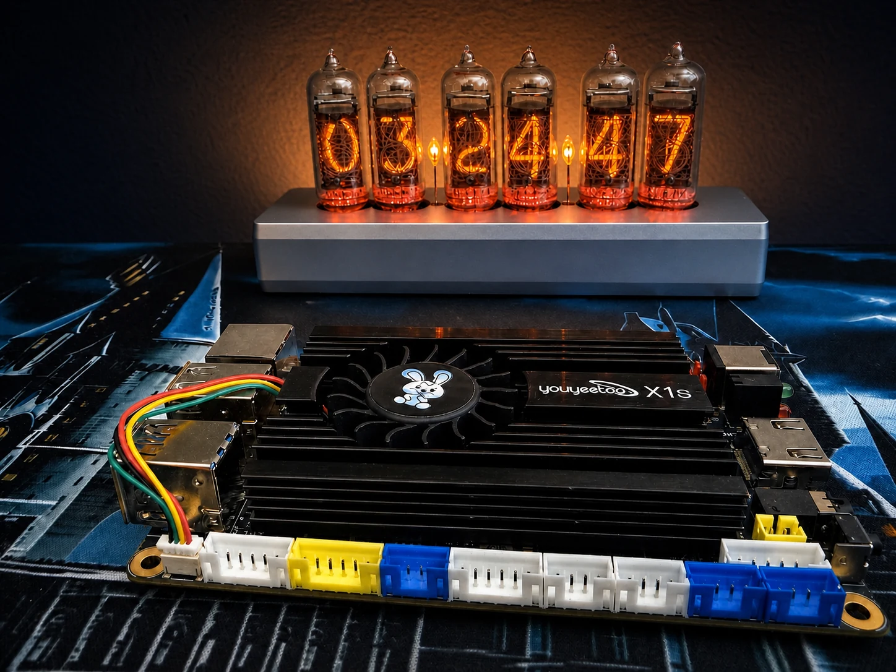

# Youyeetoo X1S Kali Lab



I usually work at two ends of the small-computer spectrum: ARM boards like the Raspberry Pi and Indiedroid Nova, or complete x86 laptops like my ThinkPads. The Youyeetoo X1S lands in the interesting space between them. It has the exposed form factor of an SBC, but it runs the normal amd64 Kali stack like a small Intel PC.

This repository contains the installation notes, scripts, selected raw evidence, and benchmark results behind two connected write-ups:

- **[Testing the Youyeetoo X1S for a Budget Kali Cyberdeck](https://unland.dev/blog/budget-cyberdeck-youyeetoo-x1s-kali)** covers the NVMe rebuild, thermals, Kali workflow, and first CPU-only model pass.
- **[Ollama vs llama.cpp on the Youyeetoo X1S: CPU and Vulkan Benchmarks](https://unland.dev/blog/youyeetoo-x1s-ollama-llamacpp-vulkan-benchmarks)** is the separate runtime follow-up.

## Installation outcome

The first USB installation failed while reading its own source media. BusyBox reported a hash mismatch, followed by device-offline and ISOFS errors from the USB path. The successful retry used a USB 3 port and Kali's text installer, then installed Kali to the internal NVMe. Because two variables changed, the evidence does not isolate one definitive root cause. The complete installation record is in [`INSTALLATION.md`](INSTALLATION.md).

## What I found

The X1S completed a verified 15-minute all-core `stress-ng` run with four workers, 100% sampled CPU use, no recorded throttle event, and no relevant kernel or service failure. The CPU package peaked at 77 °C in the supplied open-bench heatsink and active-fan configuration. The NVMe stayed at 35.9 °C.

Kali's standard amd64 desktop, top-10 tools, and default tool collection installed normally. Fourteen representative checks produced the intended output, and the integrated loopback lab joined discovery, enumeration, validation, and packet capture without touching an external target.

Local AI was useful within clear limits. In the first CPU-only matrix, Qwen3 0.6B was the fastest model tested, while Qwen3 1.7B felt like the more practical balance at 3.129 warm tokens per second. The 4B-class models stayed around 1.8 to 2.0 tokens per second. Qwen3 8B fit in memory and stopped naturally, but 0.924 tokens per second is patient, not interactive. A full-resolution Gemma 3 4B vision request produced no output before the fixed 20-minute cutoff.

Round 2 adds the requested runtime and Vulkan work. Five comparisons use the exact Q4_K_M model blobs behind the original Ollama tags. Gemma required a separate text-only compatibility copy for current llama.cpp. The report places Ollama request throughput beside llama.cpp `llama-bench` CPU and Vulkan throughput and keeps the harness limits visible. These are not identical end-to-end tests: Ollama used the natural-language request while `llama-bench` used a synthetic 128-token prompt. Qwen3 0.6B and 1.7B produced clean Vulkan gains with much faster prompt processing and lower package temperatures. The larger Vulkan rows are diagnostic only: Qwen3 4B reached a reset timeout, Phi-4 Mini and Qwen3 8B coincided with i915 GPU hangs despite zero process return codes, and Gemma 3 ended with `vk::DeviceLostError`.

The audited community follow-up adds official Qwen3.5 and Gemma 4 requests. Qwen3.5 0.8B averaged 10.44 warm tokens per second and Qwen3.5 2B averaged 4.89 on their Q8_0 Ollama tags. Gemma 4 E2B averaged 3.38 and E4B averaged 1.78 on their Q4_K_M tags. Their recorded package peaks were 70, 75, 77, and 78 °C. An official BitCPM-CANN 1B TQ2_0 file also exposed a useful runtime difference: Ollama 0.32.1 rejected it with a tensor size overflow, while llama.cpp ran the 128/96 CPU microbenchmark cleanly at 8.63 generation tok/s. The raw rows, output hashes, and exact model digests are retained in [`FOLLOWUP_RESULTS.md`](FOLLOWUP_RESULTS.md) and `results/followup/`.

## Results at a glance

| Area | Measured result |
| --- | --- |
| Kali installation | Reliable NVMe boot after the successful USB-installer retry |
| Thermal soak | 15 minutes, four workers, 77 °C peak, zero recorded throttle counts |
| NVMe temperature | 35.9 °C during the all-core soak and inference work |
| First-pass fastest text model | Qwen3 0.6B at 6.788 warm tokens/s |
| First-pass practical small model | Qwen3 1.7B at 3.129 warm tokens/s |
| 4B text models | 1.824 to 1.995 warm tokens/s |
| 8B text model | Fits in memory; 0.924 warm tokens/s |
| Full-HD 4B vision | No output before the 20-minute cutoff |
| Round 2 clean Vulkan runs | Qwen3 0.6B and 1.7B only; prompt processing was 3.3 to 7 times CPU, generation improved, and peaks were 26 to 27 °C lower |
| Round 2 unstable Vulkan rows | Qwen3 4B reset timeout; Phi-4 Mini and Qwen3 8B GPU hangs despite return code 0; Gemma 3 `vk::DeviceLostError` |
| Qwen3.5 follow-up | 0.8B at 10.44 warm tok/s; 2B at 4.89 warm tok/s; official Q8_0 Ollama tags |
| Gemma 4 follow-up | E2B at 3.38 and E4B at 1.78 warm tok/s; official Q4_K_M Ollama tags |
| BitCPM-CANN 1B TQ2_0 | Ollama 0.32.1 model-load failure; llama.cpp CPU at 13.30 prompt and 8.63 generation tok/s |
| Kali compatibility | 14/14 representative checks produced intended output |
| Local security workflow | Nmap, Metasploit, Nikto, Gobuster, ffuf, SQLmap, and TShark completed together on loopback |

## The local security workflow

I wanted more than a list of installed commands, but I did not need an external target to prove the tools could work together. The repository creates a deliberately vulnerable HTTP service bound to `127.0.0.1`, then runs a bounded sequence against that local service:

1. Nmap discovers the service.
2. Metasploit and Nikto enumerate HTTP behavior.
3. Gobuster and ffuf find the local routes.
4. SQLmap validates the intentionally injectable parameter.
5. TShark captures and summarizes the loopback traffic.

There is no credential attack, wireless injection, external scanning, or third-party system in this workflow.

## Run the bounded tests

Read each script before running it. The thermal and model scripts create new result directories, and the security workflow is restricted to loopback.

```bash
# 15-minute all-core soak with an 85 °C safety cutoff
MAX_TEMP_C=85 DURATION=15m ./scripts/thermal_soak.sh

# Version, startup, and CPU-resource checks
./scripts/kali_tool_matrix.sh

# Integrated workflow against the local test service only
./scripts/local_security_workflow.sh

# CPU-only Ollama model matrix
MAX_TEMP_C=85 ./scripts/benchmark_ollama.sh

# A selected Ollama candidate list with the same guarded runner
MODEL_LIST='qwen3.5:0.8b qwen3.5:2b' MAX_TEMP_C=85 ./scripts/benchmark_ollama.sh

# One llama.cpp CPU microbenchmark. GPU layers above zero additionally require
# passwordless read access to the kernel journal and stop on the first i915 event.
LLAMA_BENCH=$HOME/llama.cpp/build/bin/llama-bench \
  ./scripts/benchmark_llama_cpp_guarded.sh /path/to/model.gguf cpu 0
```

## Repository map

- [`INSTALLATION.md`](INSTALLATION.md) covers the USB-installer-to-NVMe rebuild and first-attempt failure.
- [`METHODOLOGY.md`](METHODOLOGY.md) defines the workloads, safeguards, and measurement boundaries.
- [`BENCHMARK_RESULTS.md`](BENCHMARK_RESULTS.md) contains the inference, vision, idle, and thermal results.
- [`ROUND2_RESULTS.md`](ROUND2_RESULTS.md) documents the Ollama, llama.cpp CPU, and Vulkan measurements, including every retained negative result and the corrected kernel-event timeline.
- [`ROUND2_PROTOCOL.md`](ROUND2_PROTOCOL.md) records the completed method, its limits, and a clean same-request plan for the next pass.
- [`CANDIDATE_MODEL_TABLE.md`](CANDIDATE_MODEL_TABLE.md) keeps completed measurements separate from models that need a clearly identified artifact and their own benchmark pass.
- [`FOLLOWUP_RESULTS.md`](FOLLOWUP_RESULTS.md) adds the official Qwen3.5 0.8B, Qwen3.5 2B, Gemma 4 E2B and E4B, and BitCPM-CANN 1B TQ2_0 results and records what still needs a separate test.
- [`KALI_TOOL_RESULTS.md`](KALI_TOOL_RESULTS.md) documents the compatibility matrix and integrated local workflow.
- [`scripts/`](scripts/) contains the guarded collectors and test runners.
- [`results/`](results/) contains selected JSON, CSV, command output, package inventory, health checks, and telemetry. [`results/round2/`](results/round2/) contains the sanitized round-2 summaries, model-blob digests, and GPU-hang evidence.
- [`images/`](images/) contains the publication-safe hardware and installation photographs.

## Test boundaries

These results describe one X1S with the supplied heatsink and active fan in an open-bench configuration. I did not instrument ambient temperature or wall power, and I did not use an enclosure. The Pi and Nova work on my site is useful context, but it is not a matched three-board benchmark with identical runtimes and model artifacts.

Use Kali tools only on systems you own or are explicitly authorized to test.

## Disclosure

Youyeetoo supplied the X1S review unit and the 128 GB NVMe. The testing and conclusions are my own.

## License

The executable scripts are available under the [MIT License](LICENSE). The photographs, written benchmark material, and result artifacts remain copyright Trevor Unland unless a file says otherwise.
